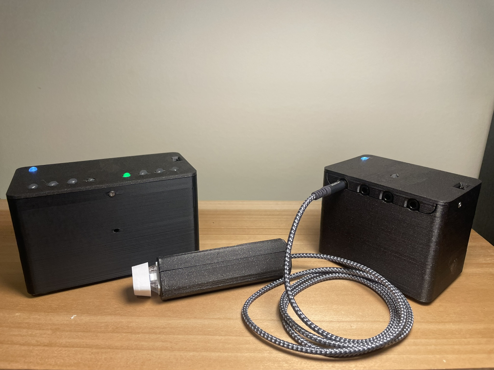

**Hybrid Quiz Bowl Buzzers**

I built these semi-wireless quiz bowl buzzers to replace my high school teams' aging wired set. The hybrid approach—wireless team stations with wired individual clickers—is more convenient than fully wired systems and scales more efficiently than fully wireless approaches. 

The project uses three ESP32 based boards communicating via a uniderectional ESP-NOW link for robust low latency communication. Firmware built with ESPIDF. 

Read more on my blog.