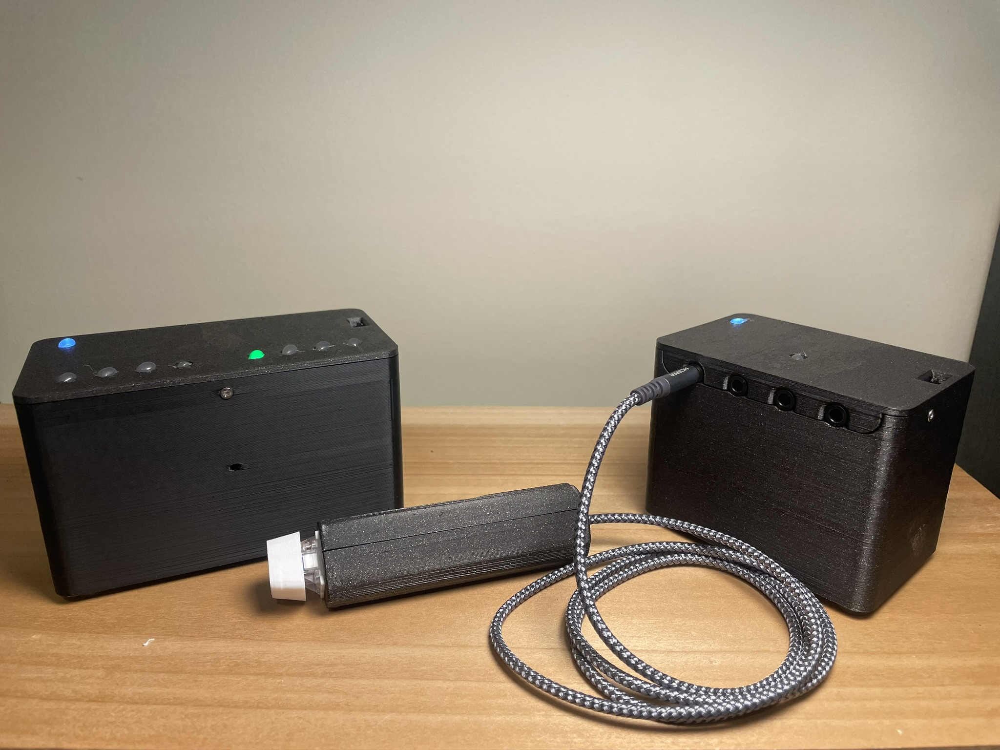

# Hybrid Quiz Bowl Buzzers
***[Try a demo of the Reader Console here!](https://jpetkauskas.github.io/Hybrid-Buzzer/)***

This project uses three ESP32 based boards communicating via a unidirectional ESP-NOW link for robust, low latency Quizbowl lockout arbitration. A custom autopairing algorithm eliminates hardcoded MAC addresses and improves usability. The receiver also runs a novel SoftAP web server which hosts a scoring terminal for the reader, digitizing and simplifying tedious quizbowl scoring and adding analysis capability. Synchronized buzzer timing system  coordinates transmitter nodes based on receiver time, arbitrating winner based on incoming timestamps so that near-simultaneous buzzes aren't dropped, reaching 50/50 performance on true-simultaneous buzzes, 95/5 on 25uS deltas, and 100/0 correct arbitration for deltas >=50 uS (0.5 ms).

I built these buzzers to replace my high school teams' aging wired set. The hybrid approach—wireless team stations with wired individual clickers—is more convenient than fully wired systems and scales more efficiently than fully wireless approaches. 

[See my writeup for more details.](https://justinaspetkauskas.com/writeups/hybrid-buzzers)